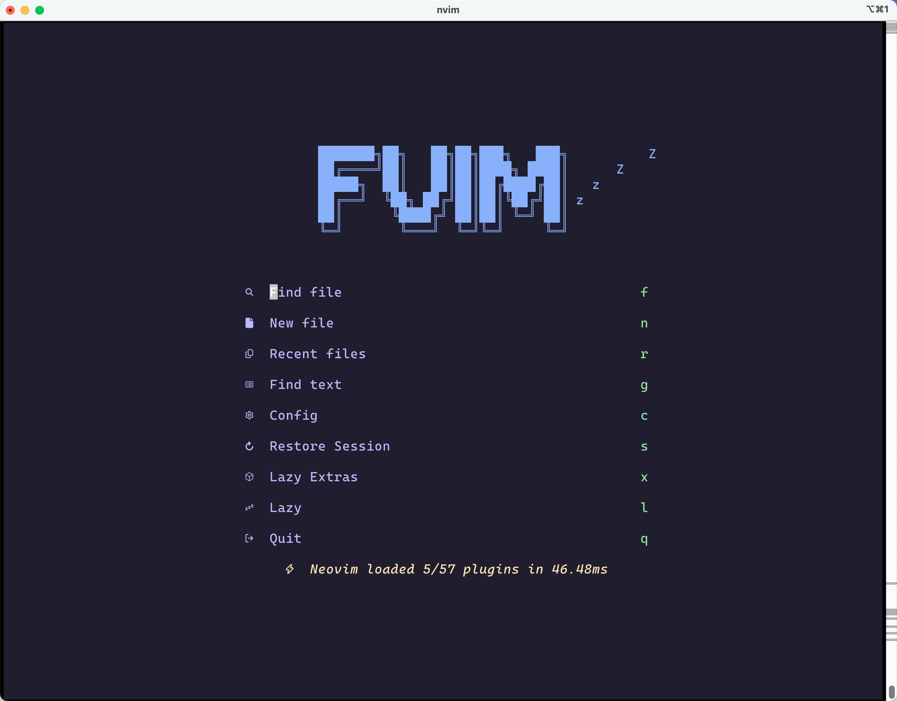

# 💤 FVim

A starter template for [LazyVim](https://github.com/LazyVim/LazyVim).
Refer to the [documentation](https://lazyvim.github.io/installation) to get started.

## require

- [fzf](https://github.com/junegunn/fzf)
- [deno](https://github.com/denoland/deno/)(Markdown Preview)

## Shortcut Keys

- Markdown Preview `<leader>m(p/P)`
